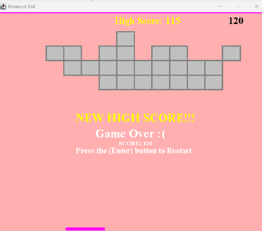

# Object Oriented Programming - Final Project : Brick Breaker 

Brickbreaker is a popular and timeless game, with variations available on different platforms, including arcade machines, home consoles, and mobile devices. Its simplicity and addictive nature have made it a beloved classic in the world of video games. The game starts with a window (a map) that consists of several rows of rectangular shapes (bricks) at the top. At the bottom of the screen, there is a paddle that the player controls. Above the paddle, there is a ball ready to be launched. The game begins by launching the ball from the paddle towards the bricks. The ball moves in a straight line and bounces off the walls and bricks it encounters.  The player's goal is to break all the bricks on the screen. To break a brick, the player needs to hit it with the ball. When the ball hits a brick, the brick disappears, and the player earns points. The player controls the paddle horizontally, using the left and right arrow keys. The paddle's movement helps the player position it under the ball to bounce it back up towards the bricks. When the ball hits the paddle, it bounces back up towards the bricks. The angle at which the ball bounces depends on the position where it hits the paddle. By controlling the paddle's position, the player can influence the ball's trajectory and aim it towards desired targets. As the game progresses, the ball continues to move and bounce around the game screen. The player must keep the ball from reaching the bottom edge of the screen. If the ball touches the bottom edge, the player loses a life. The player earns points for breaking bricks. The score can be based on the number of bricks destroyed. The game continues until the player chooses to start over or quit. Can you set a new high score?

## How to use the program

### All you need to do is run the maingame code.

### Program report: https://docs.google.com/document/d/1Ud8YBSSOviIlPs-GsDNuaHuRTtL8_h2O-1AgGCHiWRQ/edit?usp=sharing

### Video Link: https://www.youtube.com/watch?v=2B81xjFUTNs

##

### This is the preview of the game.

This is the Beginning Screen

This is the Game Over Screen

This is the New High Score Screen

This is the You Won Screen

##
##### Have fun!
